# The Cymraeg Challenge 

## About
The Cymraeg Challenge is an interactive game where users click on cards to reveal a Welsh or an English word. Users then have to try and match the word to its translation. When users match the cards correctly, the cards will disappear, and a point will be added to the score at the bottom of the page. When a user has incorrectly chosen a word pair, the card will ‘flip back over’, hiding the words on them and the game continues.  On finding all the word pairs, a notification congratulating the user on completing the game and asking if they want to play again will appear. 
In the header, there will be a ‘how to play’ link under the title. When clicked on, a notification telling users how to play the game will appear. 
## User Experience (UX)
### User Stories
Reasons a user might visit the website:
* Users who are learning Welsh and want to consolidate their skills
* Users who want a fun game to kill some time

Reasons for the website:
* Teach basic Welsh vocabulary
* Provide a resource for Welsh learners to revise their skills
* Entertain users
## Scope
A user may expect:
* Easy to navigate website design
* Visually appealing and well presented on all screen sizes
* Well-functioning links and features
* Information on how to play the game
A user may want:
* A congratulation message to notify you when you have won the game
* A running score during the game
As a developer/business I expect: 
* An engaging interactive game which makes users want to play again 
* A responsive website that attracts users
## Structure
This website will consist of:
* A page consisting of a header (containing a title and how to play link), 12 equally sized cards and a footer with a score
* A how to play notification which explains how to play the game 
* A congratulations notification that appears at the end of the game
## Design 
### Surface
#### Colour
The main colour scheme is an off-white colour (chosen to reduce eyestrain compared to pure white), a dark red, a mid toned red, a dark green and a mid-toned green.
The colour scheme was directly lifted from the colours of the Welsh flag, and then adjusted to improve contrast ratings. The colours do not impact on the ability to play the game, making it accessible for those who are red/green colour blind.

#### Typography
Karla was imported from google fonts for use in this project. Karla was chosen for its simple appearance and readability. As a sans-serif font, it avoids some of the issues associated with letters blending together for dyslexic readers.

#### Call to Action
The main call the action (the play button) is placed in a central location on the screen. It has a green border to draw attention to it and the font size has been considerably increased. Upon hovering, the cursor changes to a pointer to indicate that it can be clicked on.
The same is true of the How to Play button. As it is only intended to be viewed once (the game is pretty simple!), it is smaller but is underlined on hover. 

#### Imagery
As this game is the Cymraeg Challenge and intended for users who wish the learn welsh vocabulary, it made sense to use imagery associated with Wales. On load, the cards have a daffodil background (the national flower of Wales). On click, this dissapears so the text contained within the cards is easy to read. 

### Skeleton

#### Layout
This website consists of just one page. A max width was set so that the content remains central on very large screen sizes. While the site looks best on desktop, it can
also be used on mobile as this was considered the starting point for the overall design. 

Where appropriate, margins and padding was added to elements to ensure elements are readable and easy to interact with across all screen sizes.

The original plans, created on Balsamiq, can be seen before. It can be seen that I have remained faithful to the original designs.

#### Wireframe of landing page
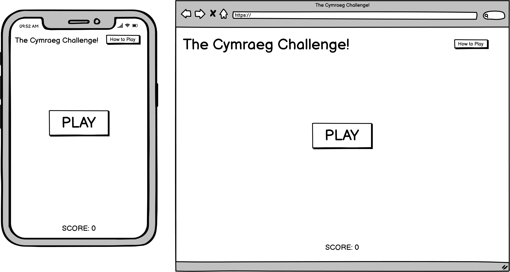

#### Wireframe of page with the game cards revealed
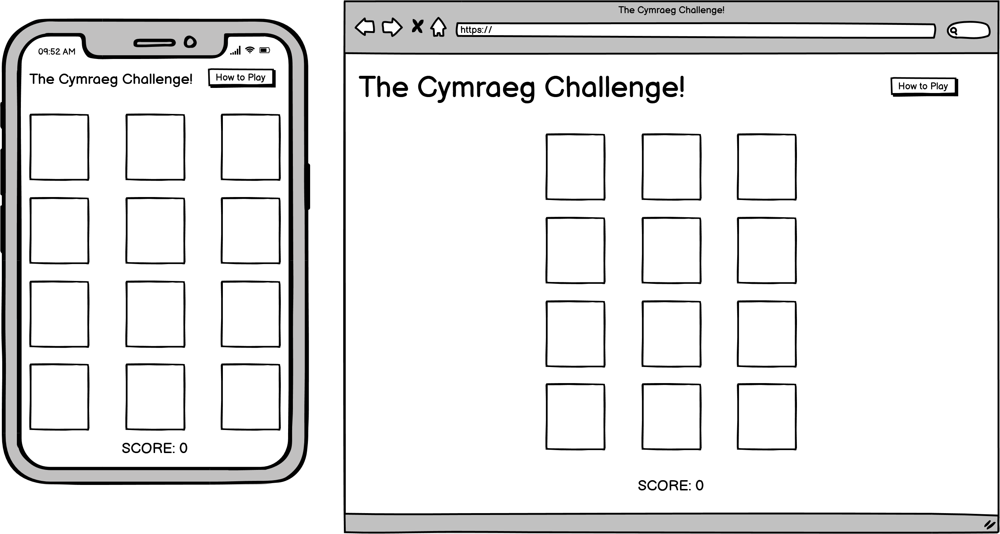

#### Wireframe of page with help text visible
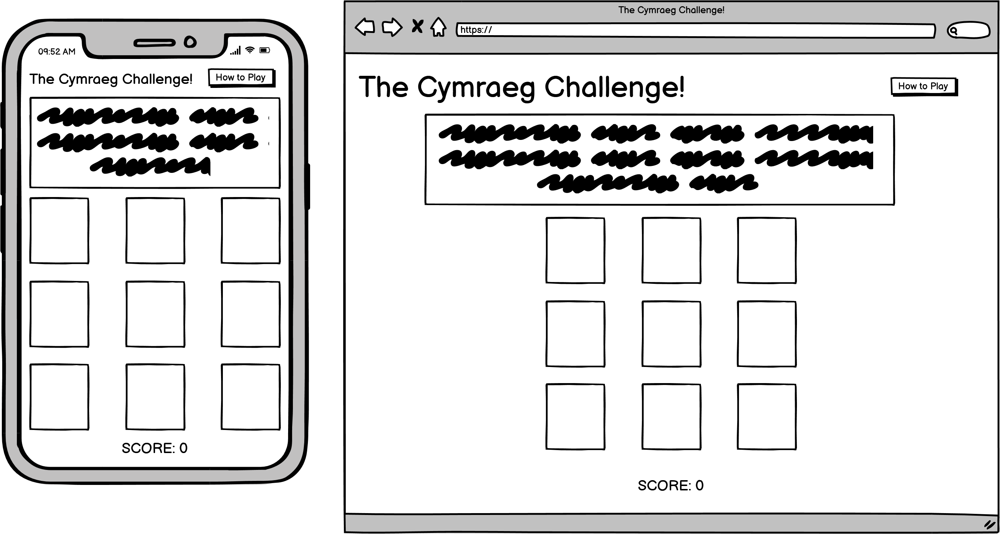

#### Wireframe of page with congratulation text visible
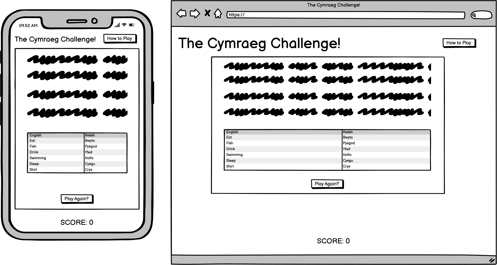

#### Mockups

Opening Screen
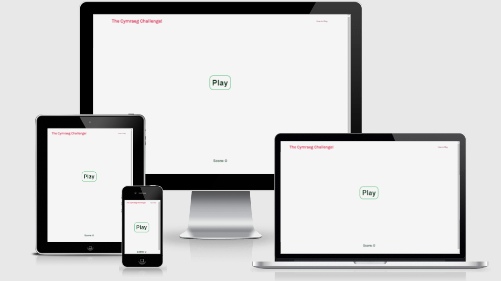

Cards revealed
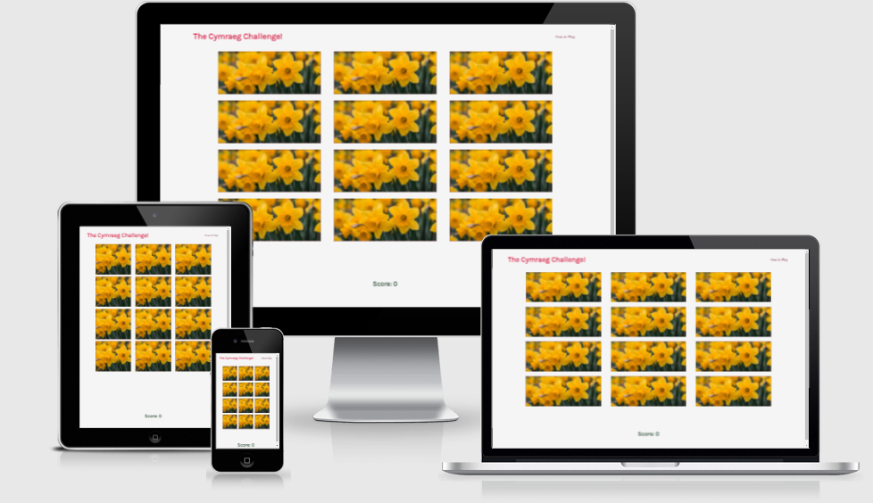

How to Text open
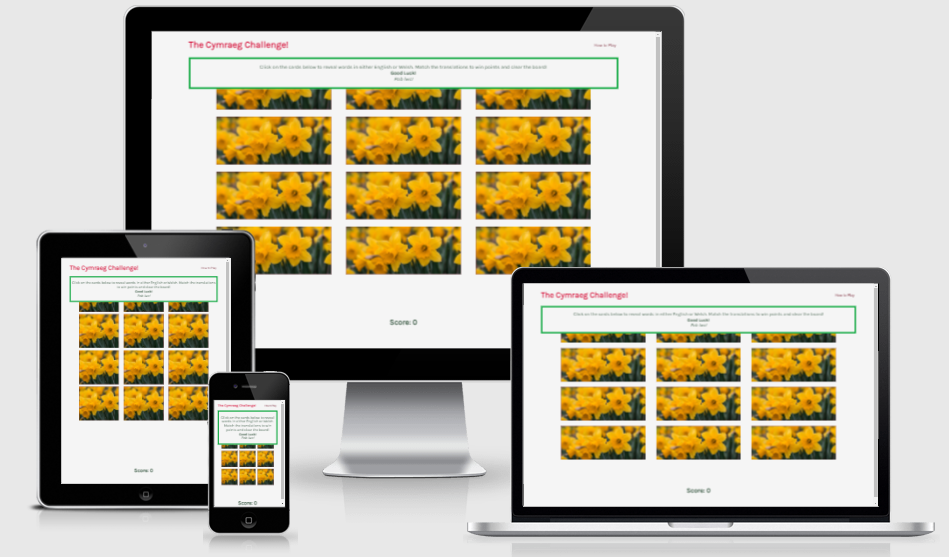

Congratulations text open
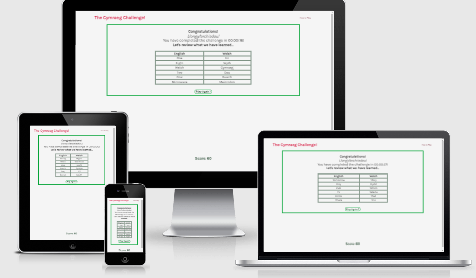

### Features

#### Logo and Navbar
The header consists of two elements, the logo and the how to play text. The how to play text allows players to view a brief run down of how to play the game. The
how to text is available to view at any time, including during the game. When hovered over, the how to play text is underlined and the cursor changes to a pointer, to indicate that it is clickable. The text on the navbar is bright red and contrasts well against the background.

#### Responsiveness
The game is designed to work on 320px screens upwards. This has been achieved using media queries and Bootstraps’ responsive columns. A max width has been set in the root directory. At the max-width, the main body of the game, the nav bar and footer will stop expanding, remaining in the center of the screen. 

#### Accessibility
A high degree of colour contrast has been used in this website's design to improve readability. 
The words chosen are suitable for absolute beginners at the Welsh language. 
Colours have not been used in such a manner that differentiating between colours would be essential for playing the game. 
All font sizes are supplied in rem so they resize appropriately when someone has their own settings for font size.

#### Footer
The footer consists of a Score element which is updated everytime a user scores (10 points per pair of cards matched). The score element is centered so it is easy to see while playing the game. 

#### Meta data
Descriptions, author’s name, and keywords were included in the head element to increase traffic to the website. 

#### Future Features
In the future this game could be expanded to add more Welsh words. It could also be expanded to include different levels of difficulty, either by creating a new 'harder' bank of Welsh/English words or introducing a time limit.

### Technologies Used
* HTML5
* CCS3
* Javascript
* Gitpod.io
* GitHub
* GIT

#### Design
* Google fonts
* Balsamiq wireframe
* Tiny PNG
* Beautifier

#### Testing
* HTML Validator
* CSS Validator
* DEV Tools – Lighthouse
* Wave
* Lambdatest

### Validator Results

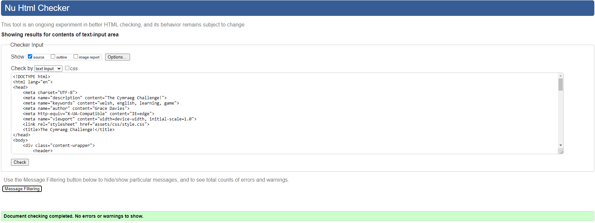
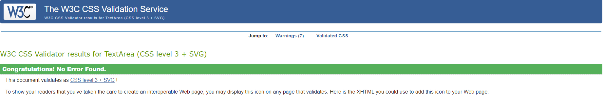

Code was run through HTML, CSS and JSHint validators. There were no errors found on either the HTML and CSS validators. 

The JSHint flagged no major errors.

### Usability Testing
This website has been tested on screen sizes ranging from 320px to 5000px using developer tools. 

When deployed, the website was tested on various OS and devices (detailed in subsequent sections).

| Test Label      | Test Action        | Expected Outcome | Test Outcome |
| --------------- |:------------------:| ----------------:|--------------|
|Smaller Sizes    |Reduce screensize on devtools|Cards are reduced in size to fit screen| PASS
|                 |                             |Text resizes and continues to fit within cards| PASS
|                 |                             |Score remains visible below game area| PASS
|Larger Sizes     |Expand screensize on devtools|Cards expand to suit screen size to a cut off point| PASS
|                 |                             |Game/navbar elements/score remains central beyond max-width| PASS
|                 |                             |Score does not block bottom of game area| PASS
|How-To Text      |Click while cards are visible| Text appears ontop of card elements| PASS
|                 |Click while play button is visible| Text does not block play button| PASS
|                 |Click while congrats text is visible|Text remains readable, overlaying congrats text| PASS
|Buttons          |Click play button   | Cards are generated in their unclicked state| PASS
|                 |Click play again button| A new set of cards/words are generated| PASS
|Animations       |Hover over cards    | Cards should grow on hover BEFORE being clicked| PASS
|                 |                    | Cards should not grow on hover AFTER being clicked| PASS
|                 |Hover over clickable elements| Cursor changes to pointer, indicating clickability| PASS
|Cards            |Click the same card more than once| Does not allow multiple clicks/submission of data-index value| PASS
|                 |Reset game by pressing Play Again button| All cards from previous game are gone and replaced with new cards and new words| PASS
|                 |Make a correct guess| Cards turn green and their words remain visible| PASS
|                 |                    | Score increases by 10| PASS
|                 |                    | Previous 'correct guesses' remain visible| PASS
|                 |                    | When all cards have been matched, the cards dissappear and congratulations text appears| PASS
|                 |Make an incorrect guess| Cards are revealed for half a second and then their words/backgrounds return to their pre-click state| PASS
|                 |                       | Previous 'correct guesses' remain visible| PASS
|Congrats text    |Play game, win, then press Play Again and win| Translation table appears with words covered in the previous game| PASS
|                 |Play game, win then press Play Again |Congrats text and children disappear| PASS
|Score            |Play game, win, then press Play Again| Score carries over to next game| PASS
|                 |Make incorrect guess| Score does not increase| PASS

To ensure that the words remain appropriately sized within cards, a media query was used to target very small screen sizes to make the font smaller. 
On screens bigger than 1500px, the max-width of the main page elemets, the website is still functional and no elements stretch or warp. Text remains clear on very small to very large sizes.

### Browser Compatibility

The website has been tested on chrome, internet explorer safari and firefox. Apart from some differences in styling, the website works consistently across platforms. Safari does not load the background image of the cards
so reverts to the backup colour, meaning the text remains visible.
When using Internet Explorer the landing screen loads, but the colour scheme does not and the buttons do not work.
This is due to Internet Explorer not being compatible with some of the latest JavaScript and CSS releases.
As very few people use Internet Explorer nowadays, this is considered negligable.

### OS Compatibiility

The website has been tested on iOS and android. Apart from similar issues with the iOS to safari, the game is playable on both.

### Performance Testing

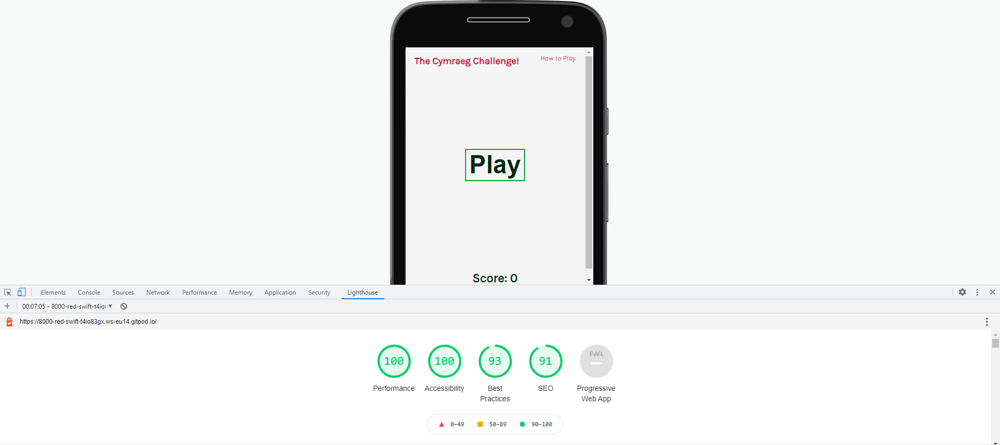
The website scored the following: Performance = 100, Accessibility = 100, Best Practices = 93, SEO = 91.

### User Stories

To recap, the user stories identified at the beginning of this project were as follows:

* Users who are learning Welsh and want to consolidate their skills
* Users who want a fun game to kill some time

As a developer/business I expect: 

* An engaging interactive game which makes users want to play again 
* A responsive website that attracts users

To address how the needs of these users are met by this website, screenshots of revelant features will be included below followed by a brief explanation.

#### Interactive Elements
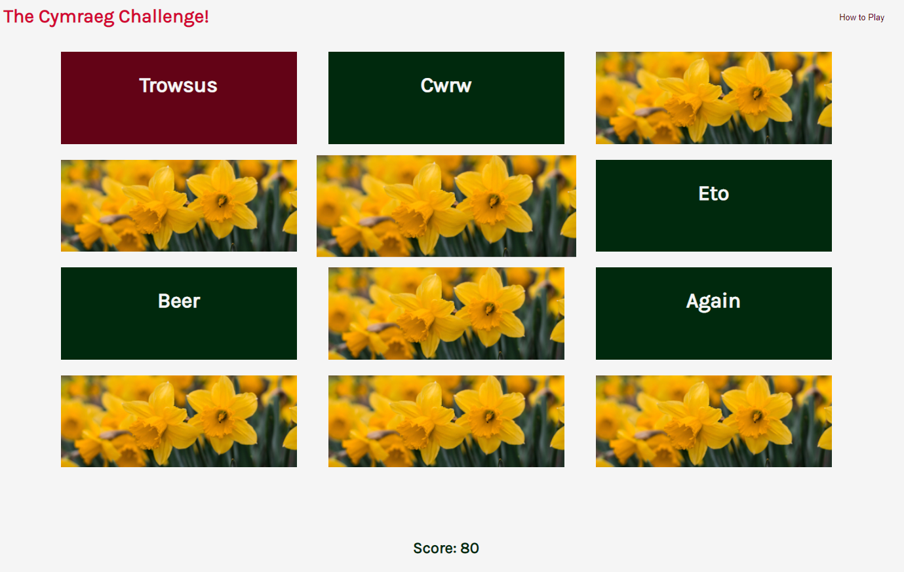

The site includes many interactive elements, including cards that change on hover, on click and on a correct match. Cards become slightly larger when hovered over, reveal their inner text and change to a red colour on click and on a correct guess, turn green. Should two cards not match, their innner text remains visible for a quarter of a second before returning to their pre-click state. This creates a fun and engaging environment for users. The colours of the cards serve as a visual cue that a guess was correct or incorrect, however, the game does not rely on being able to distinguish between the colours in order to play. The innertext disappearing or remaining visible as well as the score increasing, also indicates to users that they were correct or incorrect in their guess.

Each correct guess adds 10 to the score at the bottom. This serves as an additional reward to users encouraging them to play again. 

Other interactive elements include the play buttons and the how to play button. Hovering over the how to play button changes its background to a dark red and its text to an off white. This remains on click. The text informs users how to play the game. As it is rather self explanatory, its short and does not require a lot of prior knowledge of the welsh language to play. To close the text, users can either click again on the how to play button or click anywhere else on the screen for an easy exit. 

Changes to the cursor also indicate to users that an element is interactive. 

#### Congratulation Text

The congratulation text appears after finishing a game by matching all the cards available. For users hoping to improve their Welsh language skills, it contains a table of translations covering the words featued in the previous game, so they can consolidate their knowledge. The game logs how long it took for the user to complete the game and the time is shown on this screen, before being reset when Play Again is clicked. The Score at the bottom remains displayed and will carry over to the next game. For both user groups, this provides a gameified experience. Users may choose to beat their previous score every day as a way of revising their vocabulary skills, or want to complete the next game faster than the last time. Users are encouraged to play again with the prominent Play Again button at the bottom, which resets the cards with a new set of words. This keeps the game fresh and fun, and means that learners can learn more words each time they play. 

#### Responsive Design 
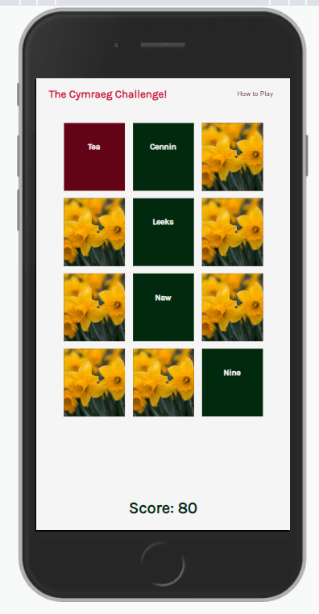

As this is a quick and not particularly tasking game, it only makes sense that it would suit mobile phone useage. For users who just want to kill five minutes waiting for a bus, the website will appear to be appropriately sized and still playable on most mobile phones. The smallest screen size accounted for is 320px in width, and the website should remain well-designed and playable at all sizes upwards from this. 

### Deployment
#### Deploying via GitHub Pages
This website is hosted by GitHub Pages. This was acheived by navigating to the repository in question, clicking the settings button, then selecting the Pages section.
From here, the master branch was selected for deployment. Deployment may take some time to complete, but once ready GitHub provides a link to the website. At any time, 
you can change who can access the website you have created. For this project, this page is public. 

#### Adding and Committing 
First step is opening the repository and clicking the green Gitpod button. This will then show you the coding interface. 
From here you can create new files (by right clicking on the left column showing the files) and selecting New File. You can also check
whether a file is untracked or modified, as they will appear with either an U or M next to the file name. 
To add a file to the repository, type 'git add' followed by the file name into the terminal. This will prep the file for the commit.
To commit the file, type 'git commit -m' followed by details of your commit wrapped in quotation marks. Make sure these details are explicit, as
they will allow you or others to identify what has been changed in each commit. 
To push the files you have just commited to the repository, type 'git push' into the terminal.

#### Cloning
You can clone a repository to have a local copy on your computer which you can then sync between the two locations.
The following instructions are for cloning a repository on github.com rather than the desktop app.
First you must go to the main page of the repository you wish to clone. There should be a green code button above the list of files.
Here you will have the choice to clone from HTTPS or SSH key.To clone from HTTPS, just paste the address into the box provided.
Next, open Git Bash and change your current working directory to wherever you want the new cloned directory to appear. Type 'git clone' followed by the URL you copied and pasted earlier into the terminal, then press enter to begin the clone.

#### Forking
To create a copy of a repository, you can fork it! This allows you to experiment without altering the original.
Creating a fork is as simple as a navigating to the main page of a repository, and clicking the 'Fork' button (next to the Star and Watch buttons).

### Bugs
FIX cards were not shuffling correctly after first game. By moving the empty cardContainer variable and producing a new function that wipes all the classes from
the cards before the next game, this was fixed.
FIX issue where words that did not match disappeared instantly. This was fixed with a timeout which allows 250 milliseconds before readding the hidden class.
FIX issue where clickedCards and dataCompare were not emptying when greater than 2 in length. This was fixed with emptying the array after comparing the values within.
FIX cards could be clicked when two incorrect cards were visible. A new function removing the event handler from cards when more than one incorrect card is open was added.
FIX after an incorrect guess, the second card was not going back to original size after click. This was fixed by changing the property of card:active.
BUG website does not work on Internet Explorer (see previous sections for more details).

### Credits

Thank you to my mentor Brian for his continued support during this course. 
Thank you to John the tutor for his input and patience during this project. 

#### Inspiration and Planning
All code is my own unless otherwise stated.
Live Coding A Memory Game: HTML, CSS, Javascript - https://www.youtube.com/watch?v=bbb9dZotsOc
Flip - card memory game - https://codepen.io/zerospree/pen/bNWbvW